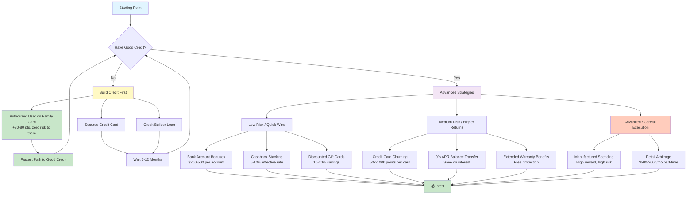
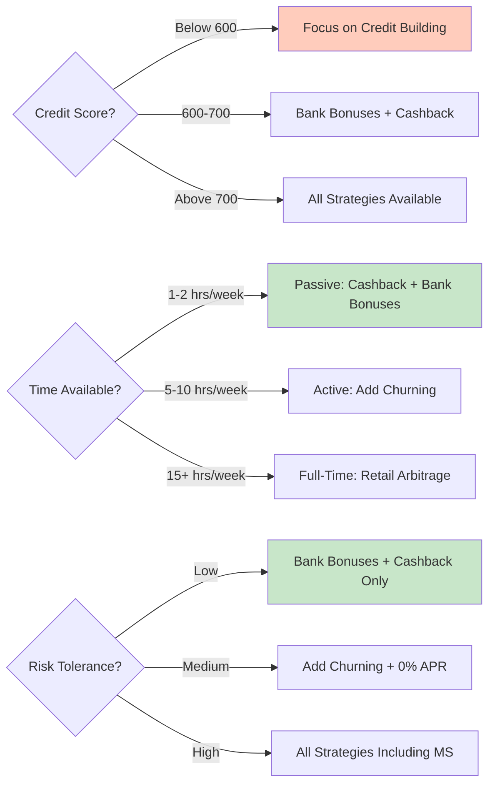

# Arby - Financial Arbitrage & Money-Making Ideas

Collection of verified strategies for generating extra income through arbitrage and financial optimization.

## Strategy Flow

## Decision Tree: Which Strategy Is Right For You?

## Credit Card Arbitrage

**Basic concept:** Use someone with good credit → get cashback → pay immediately → they owe you = free money from rewards (1-5%).

**Reality check:** Routing purchases through someone else's card for cashback splitting is mathematically meh. On $500/month you'd earn $5-25 to split. The coordination overhead isn't worth it — especially the mental load. Only worth it on high-category spending you'd do anyway (e.g. 5% groceries).

### The Real Play: Authorized User

Way more valuable than cashback splitting. This is credit building, not pocket change.

- Their card's **full payment history** gets added to your credit report
- If the card has years of on-time payments, your score can jump **+30-80 points**
- You don't need to hold or use the physical card
- They keep full control — can remove you with one phone call
- **Zero risk to them** — their score isn't affected

**The Pitch:** "You don't give me a card. You don't give me access. Nothing changes for you. You just call the bank and add my name. That's it. It helps me build credit and costs you nothing."

## Verified Money-Making Strategies

### 1. Bank Account Bonuses
- Open checking accounts with signup bonuses ($200-500)
- Meet minimum requirements (direct deposit, balance, etc.)
- Close after 6 months
- Rinse and repeat
- **Risk:** Can affect ChexSystems score if done too frequently

### 2. Cashback Stacking
- Use multiple cashback platforms on same purchase
- Example: Rakuten (5%) + credit card (1.5%) = 6.5% total
- Browser extensions auto-find best cashback rates
- **Platforms:** Rakuten, Honey, TopCashback

### 3. Credit Card Churning
- Open cards for signup bonuses (50k-100k points)
- Meet minimum spend requirement
- Use points for travel/cashback
- Cancel after one year (avoid annual fee)
- **Warning:** Can temporarily hurt credit score, requires discipline

### 4. Discounted Gift Cards
- Buy gift cards at 10-20% off face value
- Use for regular purchases
- **Platforms:** Raise, CardCash, Gift Card Granny
- **Risk:** Minimal if buying from verified sellers

### 5. Credit Card Price Protection (Legacy)
- Some cards refund price drops within 60-120 days
- Buy item → price drops → submit claim for difference
- **Note:** Many issuers discontinued this (2018-2020)

### 6. Extended Warranty
- Many cards double manufacturer warranty automatically
- Free protection on electronics, appliances
- Can save $50-200+ on extended warranty purchases

### 7. Manufactured Spending (Advanced)
- Buy money orders with credit card → deposit → pay off card
- Generates cashback/points with no net spend
- **Warning:** Banks crack down on this, high risk of account closure

### 8. Retail Arbitrage
- Buy clearance items → resell on Amazon/eBay
- Requires time, storage, shipping
- Can generate $500-2000/mo part-time
- **Tools:** Amazon Seller app, eBay, Facebook Marketplace

## Credit Building (Start Here First)

If you have poor/no credit, focus here before churning:

1. **Secured Credit Card**
   - Put $200-500 deposit
   - Get equal credit limit
   - Use for small purchases, pay in full
   - After 6-12 months, upgrade to unsecured

2. **Authorized User on Good Account**
   - Get added to parent/spouse card with good history
   - Their full payment history reports to your credit
   - Instant boost to credit age/score (+30-80 points)
   - You don't need the physical card — they keep full control
   - Zero risk to them — one phone call to remove you anytime

3. **Credit Builder Loan**
   - Pay into savings account, build credit
   - Get money back after 12 months
   - Improves payment history

4. **Rent/Utility Reporting**
   - Services like Experian Boost add rent/utilities to credit report
   - Usually free or low cost

## 0% APR Balance Transfer Strategy

Once credit improves:
1. Get 0% APR balance transfer card (12-21 months)
2. Transfer high-interest debt
3. Pay off during promotional period
4. Save hundreds in interest

**Watch out for:** Balance transfer fee (3-5%)

## Tools & Resources

- **Credit monitoring:** Credit Karma, Experian (free)
- **Cashback trackers:** Rakuten, Honey, TopCashback
- **Gift cards:** Raise, CardCash
- **Bank bonuses:** Doctor of Credit (website)
- **Churning community:** r/churning (Reddit)

## Warnings

- **Don't** spend money just to get rewards
- **Don't** carry a balance (interest negates cashback)
- **Don't** open too many cards at once (hard inquiries hurt score)
- **Don't** close cards right after getting bonus (looks bad)
- **Don't** do manufactured spending without understanding risks

## Status

All strategies verified as of 2026-02-10. Market conditions change - always verify current offers before executing.

---

*This is not financial advice. Do your own research.*
