# Arby - Financial Arbitrage & Money-Making Ideas

Collection of verified strategies for generating extra income through arbitrage and financial optimization.

## Strategy Flow

```mermaid
graph TD
    Start[Starting Point] --> CheckCredit{Have Good Credit?}

    CheckCredit -->|No| BuildCredit[Build Credit First]
    CheckCredit -->|Yes| Advanced[Advanced Strategies]

    BuildCredit --> SecuredCard[Secured Credit Card]
    BuildCredit --> AuthUser[Authorized User on Family Card]
    BuildCredit --> CreditBuilder[Credit Builder Loan]

    SecuredCard --> WaitTime[Wait 6-12 Months]
    AuthUser --> WaitTime
    CreditBuilder --> WaitTime
    WaitTime --> CheckCredit

    Advanced --> LowRisk[Low Risk / Quick Wins]
    Advanced --> MedRisk[Medium Risk / Higher Returns]
    Advanced --> HighRisk[Advanced / Careful Execution]

    LowRisk --> BankBonus[Bank Account Bonuses<br/>$200-500 per account]
    LowRisk --> Cashback[Cashback Stacking<br/>5-10% effective rate]
    LowRisk --> GiftCards[Discounted Gift Cards<br/>10-20% savings]

    MedRisk --> Churning[Credit Card Churning<br/>50k-100k points per card]
    MedRisk --> BalanceTransfer[0% APR Balance Transfer<br/>Save on interest]
    MedRisk --> Warranty[Extended Warranty Benefits<br/>Free protection]

    HighRisk --> Manufactured[Manufactured Spending<br/>High reward, high risk]
    HighRisk --> RetailArb[Retail Arbitrage<br/>$500-2000/mo part-time]

    BankBonus --> Profit[💰 Profit]
    Cashback --> Profit
    GiftCards --> Profit
    Churning --> Profit
    BalanceTransfer --> Profit
    Warranty --> Profit
    Manufactured --> Profit
    RetailArb --> Profit

    style Start fill:#e1f5ff
    style Profit fill:#c8e6c9
    style BuildCredit fill:#fff9c4
    style Advanced fill:#f3e5f5
    style HighRisk fill:#ffccbc
```

## Decision Tree: Which Strategy Is Right For You?

## Credit Card Arbitrage

**Basic concept:** Use someone with good credit → get cashback → pay immediately → they owe you = free money from rewards (1-5%).

**Better alternative:** Get added as **authorized user** on their card:
- Their credit history helps YOUR score
- Safest option
- No cash needed

## Verified Money-Making Strategies

### 1. Bank Account Bonuses
- Open checking accounts with signup bonuses ($200-500)
- Meet minimum requirements (direct deposit, balance, etc.)
- Close after 6 months
- Rinse and repeat
- **Risk:** Can affect ChexSystems score if done too frequently

### 2. Cashback Stacking
- Use multiple cashback platforms on same purchase
- Example: Rakuten (5%) + credit card (1.5%) = 6.5% total
- Browser extensions auto-find best cashback rates
- **Platforms:** Rakuten, Honey, TopCashback

### 3. Credit Card Churning
- Open cards for signup bonuses (50k-100k points)
- Meet minimum spend requirement
- Use points for travel/cashback
- Cancel after one year (avoid annual fee)
- **Warning:** Can temporarily hurt credit score, requires discipline

### 4. Discounted Gift Cards
- Buy gift cards at 10-20% off face value
- Use for regular purchases
- **Platforms:** Raise, CardCash, Gift Card Granny
- **Risk:** Minimal if buying from verified sellers

### 5. Credit Card Price Protection (Legacy)
- Some cards refund price drops within 60-120 days
- Buy item → price drops → submit claim for difference
- **Note:** Many issuers discontinued this (2018-2020)

### 6. Extended Warranty
- Many cards double manufacturer warranty automatically
- Free protection on electronics, appliances
- Can save $50-200+ on extended warranty purchases

### 7. Manufactured Spending (Advanced)
- Buy money orders with credit card → deposit → pay off card
- Generates cashback/points with no net spend
- **Warning:** Banks crack down on this, high risk of account closure

### 8. Retail Arbitrage
- Buy clearance items → resell on Amazon/eBay
- Requires time, storage, shipping
- Can generate $500-2000/mo part-time
- **Tools:** Amazon Seller app, eBay, Facebook Marketplace

## Credit Building (Start Here First)

If you have poor/no credit, focus here before churning:

1. **Secured Credit Card**
   - Put $200-500 deposit
   - Get equal credit limit
   - Use for small purchases, pay in full
   - After 6-12 months, upgrade to unsecured

2. **Authorized User on Good Account**
   - Get added to parent/spouse card with good history
   - Their history reports to your credit
   - Instant boost to credit age/score

3. **Credit Builder Loan**
   - Pay into savings account, build credit
   - Get money back after 12 months
   - Improves payment history

4. **Rent/Utility Reporting**
   - Services like Experian Boost add rent/utilities to credit report
   - Usually free or low cost

## 0% APR Balance Transfer Strategy

Once credit improves:
1. Get 0% APR balance transfer card (12-21 months)
2. Transfer high-interest debt
3. Pay off during promotional period
4. Save hundreds in interest

**Watch out for:** Balance transfer fee (3-5%)

## Tools & Resources

- **Credit monitoring:** Credit Karma, Experian (free)
- **Cashback trackers:** Rakuten, Honey, TopCashback
- **Gift cards:** Raise, CardCash
- **Bank bonuses:** Doctor of Credit (website)
- **Churning community:** r/churning (Reddit)

## Warnings

- **Don't** spend money just to get rewards
- **Don't** carry a balance (interest negates cashback)
- **Don't** open too many cards at once (hard inquiries hurt score)
- **Don't** close cards right after getting bonus (looks bad)
- **Don't** do manufactured spending without understanding risks

## Status

All strategies verified as of 2026-02-09. Market conditions change - always verify current offers before executing.

---

*This is not financial advice. Do your own research.*
